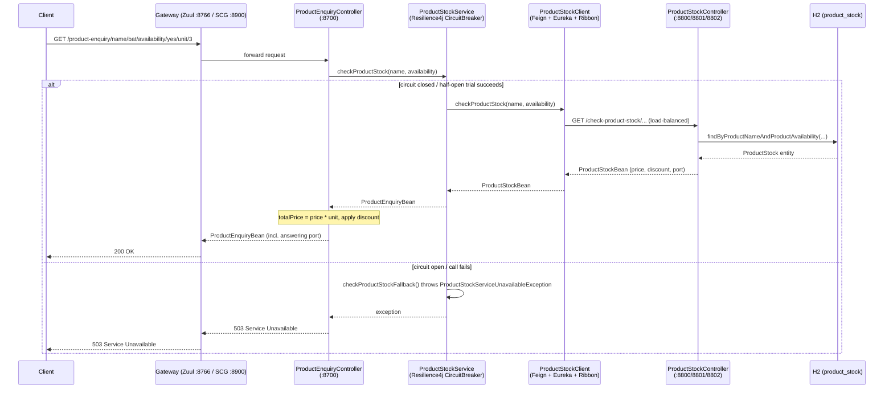
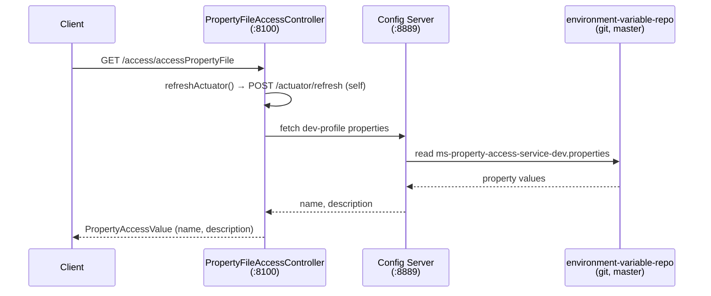

# Architecture: Service Communication & Code Flow

This document describes how the services in this repo talk to each other and traces the actual code path for each request flow. For general per-service descriptions, see [README.md](README.md).

## Overview

This is a Spring Cloud microservices demo made up of 7 modules. It illustrates two independent flows:

1. **Product enquiry flow** — a business flow using Eureka service discovery, Feign-based synchronous REST calls, and (optionally) an API gateway in front.
2. **Config server flow** — a standalone demo of externalized/dynamic configuration via Spring Cloud Config, unrelated to Eureka or the gateways.

## Service Responsibility Table

| Service | Port(s) | Responsibility | Key tech |
|---|---|---|---|
| `ms-eureka-naming-server` | 8777 | Service registry (standalone Eureka server) | Eureka Server |
| `ms-spring-cloud-config-server` | 8889 | Config server, git-backed by `environment-variable-repo/` (this same repo, `master` branch) | Spring Cloud Config Server |
| `ms-property-access-service` | 8100 | Config-client demo; fetches `name`/`description` props, self-triggers `/actuator/refresh` | Config Client, RestTemplate |
| `ms-product-stock-service` | 8800 / 8801 / 8802 | Stock/price/discount data via H2 in-memory DB | Eureka Client, Spring Data JPA, H2 |
| `ms-product-enquiry-service` | 8700 | Orchestrator — calls the stock service, computes discounted total price | Eureka Client, Feign, Ribbon |
| `ms-zuul-api-gateway-server` | 8766 | Netflix Zuul gateway, static routes | Zuul |
| `ms-spring-cloud-api-gateway-service` | 8900 | Spring Cloud Gateway (reactive), declarative route | Spring Cloud Gateway |
| `environment-variable-repo` | — | Not a service — properties data source served by the Config Server | — |

## Communication Mechanisms

- **Service Discovery (Eureka)** — `ms-product-stock-service`, `ms-product-enquiry-service`, and both gateways register with `ms-eureka-naming-server` via `eureka.client.serviceUrl.defaultZone`.
- **Synchronous REST via Feign** — `ProductStockClient` (`@FeignClient(name="ms-product-stock-service")`) resolves the stock service by its Eureka logical name, load-balanced (Ribbon) across the 8800/8801/8802 instances. A commented-out hardcoded-URL variant (`url="localhost:8800"`) is left in the code as a teaching contrast against discovery-based resolution.
- **API Gateway routing** — Zuul (`:8766`, static routes) and Spring Cloud Gateway (`:8900`, one declarative route) are **parallel alternatives, not chained** — a client picks one or the other in front of `ms-product-enquiry-service`.
- **Config Server** — git-backed by `environment-variable-repo/`. `ms-property-access-service` consumes it via `bootstrap.yml` (`spring.cloud.config.uri`) and `spring.config.import`, profile `dev`. Its controller does a self-POST to its own `/actuator/refresh` before reading `@Value`-injected properties — a manual stand-in for a full Spring Cloud Bus refresh.
- **Declared but unused** — `spring-cloud-starter-bus-amqp` (RabbitMQ) is a dependency in three services with no connection config or listeners wired up. Sleuth/Zipkin tracing dependencies are present but `sleuth.enabled: false`.
- **Circuit Breaker (Resilience4j)** — `ms-product-enquiry-service`'s call to `ms-product-stock-service` is wrapped in a circuit breaker with a fallback. See [Circuit Breaker](#circuit-breaker-resilience4j) below for the full mechanics.

## Synchronous vs Asynchronous

This is a **synchronous, request/response** architecture end to end — there is no real asynchronous or event-driven messaging in this codebase, despite one dependency that could enable it:

- **Feign** (`ProductStockClient` in `ms-product-enquiry-service`) is blocking by default — the enquiry service waits for the stock service's HTTP response before it can respond to its own caller.
- **`RestTemplate`** (used in `ms-property-access-service`'s self-refresh call to its own `/actuator/refresh`) is also a blocking call.
- **Zuul** (`ms-zuul-api-gateway-server`) is servlet-based and blocking.
- **RabbitMQ / Spring Cloud Bus** (`spring-cloud-starter-bus-amqp`) is the one dependency that *would* enable async, event-driven communication (e.g. broadcasting a config-refresh event to all instances at once) — but as noted above it's declared in three `pom.xml` files with no broker connection, listener, or producer wired up. It has no effect on runtime behavior today.

**Partial exception:** `ms-spring-cloud-api-gateway-service` is built on Spring Cloud Gateway, which runs on a reactive, non-blocking runtime (WebFlux/Netty) *internally*. That only affects how the gateway itself handles concurrent connections — the request it proxies to `ms-product-enquiry-service` still flows into the same synchronous, blocking chain described above once it leaves the gateway.

**Bottom line:** every actual service-to-service call traced in this document — Feign, RestTemplate, Zuul, and both gateways' proxying — is synchronous request/response. Nothing here is fire-and-forget or event-driven in practice.

## Code-Level Call Trace — Main Business Flow

1. **Entry (optional):** Zuul (`:8766`) or Spring Cloud Gateway (`:8900`) sits in front of `ms-product-enquiry-service` (`:8700`).
2. `ProductEnquiryController.getEnquiryOfProduct` in `ms-product-enquiry-service` receives:
   `GET /product-enquiry/name/{name}/availability/{availability}/unit/{unit}`
3. It calls `ProductStockService.checkProductStock(name, availability)`, a `@CircuitBreaker`-wrapped method that in turn calls `ProductStockClient.checkProductStock(name, availability)` — a Feign interface method mapped to:
   `GET /check-product-stock/productName/{productName}/productAvailability/{productAvailability}`
4. Feign resolves `ms-product-stock-service` via Eureka and load-balances the call across the `8800`/`8801`/`8802` instances.
5. `ProductStockController.checkProductStock` in `ms-product-stock-service` calls `ProductStcokRepository.findByProductNameAndProductAvailability(...)` (Spring Data JPA over H2), maps the resulting `ProductStock` entity into a `ProductStockBean` (`id`, `name`, `price`, `availability`, `discountOffer`) and stamps the answering `port`, read from `Environment.getProperty("local.server.port")`.
6. Seed data (`data.sql`): bat (₹5000, 20% off), ball (₹500, 40% off), helmet (₹3000, 30% off) — all availability `"yes"`.
7. Back in `ProductEnquiryController`: `totalPrice = price * unit`, `discountPrice = totalPrice - totalPrice*discount/100`. It returns a `ProductEnquiryBean` that includes which port answered — a way to visibly demonstrate load balancing across stock service instances.
8. If the call in step 3 fails (all stock instances down, timeout, connection refused, or the circuit is already open — see below), `ProductStockService`'s fallback method runs instead and throws `ProductStockServiceUnavailableException`, which `ProductEnquiryController`'s `@ExceptionHandler` turns into an HTTP `503 Service Unavailable` response instead of letting the failure propagate as a raw exception/stack trace.

## Circuit Breaker (Resilience4j)

`ms-product-enquiry-service` wraps its call to `ms-product-stock-service` in a Resilience4j circuit breaker so that a struggling or fully-down stock service degrades gracefully instead of hanging every enquiry request or leaking a raw exception to the client.

**Code:**
- `ProductStockService.checkProductStock(name, availability)` (`com.microservices.productenquiryservice.service`) is annotated `@CircuitBreaker(name = "productStockService", fallbackMethod = "checkProductStockFallback")` and delegates to the existing `ProductStockClient` Feign call.
- `ProductEnquiryController` now calls `ProductStockService` instead of `ProductStockClient` directly.
- The fallback method throws `ProductStockServiceUnavailableException`, a plain `RuntimeException`.
- `ProductEnquiryController.handleProductStockServiceUnavailable` (`@ExceptionHandler`) catches that exception and returns HTTP `503` with a plain-text message, instead of a 500 with a stack trace.

**Config** (`ms-product-enquiry-service/src/main/resources/application.yml`, `resilience4j.circuitbreaker.instances.productStockService`):

| Setting | Value | Meaning |
|---|---|---|
| `slidingWindowSize` | 10 | Circuit health is judged over the last 10 calls |
| `minimumNumberOfCalls` | 5 | At least 5 calls must land in the window before the failure rate is evaluated |
| `failureRateThreshold` | 50% | If ≥50% of those calls fail, the circuit **opens** |
| `waitDurationInOpenState` | 10s | While open, calls fail fast via the fallback for 10s — no calls reach the stock service |
| `permittedNumberOfCallsInHalfOpenState` | 3 | After the wait, 3 trial calls are let through to test recovery |
| `automaticTransitionFromOpenToHalfOpenEnabled` | true | The circuit moves to half-open on its own after `waitDurationInOpenState`, without needing an incoming request to trigger it |
| `registerHealthIndicator` | true | Circuit state is surfaced on `/actuator/health` |

**Dependencies added:** `io.github.resilience4j:resilience4j-spring-boot2` (annotation support + auto-configuration) and `spring-boot-starter-aop` (required for the `@CircuitBreaker` annotation to be proxied).

**States in practice:**
- **Closed** (normal) — calls flow straight through to `ProductStockClient`/Eureka/Ribbon as before.
- **Open** — triggered once ≥50% of the last 10 calls failed; for the next 10 seconds every call to `checkProductStock` short-circuits straight to the fallback (no network call at all), so a dead stock service doesn't also drag down the enquiry service with slow/hanging calls.
- **Half-Open** — after 10 seconds, 3 real calls are tried; if they succeed the circuit closes again, if they keep failing it reopens for another 10 seconds.

## Code-Level Call Trace — Config Server Demo Flow

1. `ms-spring-cloud-config-server` reads `environment-variable-repo/*.properties` from git (`master` branch).
2. Client calls `PropertyFileAccessController.accesPropertyFile` in `ms-property-access-service`:
   `GET /access/accessPropertyFile`
3. The controller first calls its own private `refreshActuator()`, which POSTs to `http://localhost:8100/actuator/refresh` via `RestTemplate`.
4. It then returns a `PropertyAccessValue` built from `propertyAccessBean.getName()` / `getDescription()` — values sourced from `ms-property-access-service-dev.properties` (profile `dev`) as served by the Config Server.
5. This flow is standalone: `ms-property-access-service` is **not** registered with Eureka and is **not** routed through either gateway.

## Sequence Diagrams

### Product enquiry flow

### Config server demo flow

## Notes / Caveats

- **RabbitMQ / Spring Cloud Bus** (`spring-cloud-starter-bus-amqp`) is a declared dependency in `ms-product-enquiry-service`, `ms-product-stock-service`, and `ms-spring-cloud-api-gateway-service`, but has no broker connection config, `@RabbitListener`, or producer code — it's scaffolded, not active.
- **Sleuth / Zipkin** tracing dependencies exist in several services but are explicitly disabled (`sleuth.enabled: false`, `zipkin.enabled: false`).
- **Circuit breaker scope is intentionally narrow** — only the `ms-product-enquiry-service` → `ms-product-stock-service` call is protected (see [Circuit Breaker (Resilience4j)](#circuit-breaker-resilience4j)). The config-server flow, gateways, and Eureka registration calls have no circuit breaker.
- The two API gateways (Zuul, Spring Cloud Gateway) are alternative implementations for comparison purposes, not composed together in the same request path.
