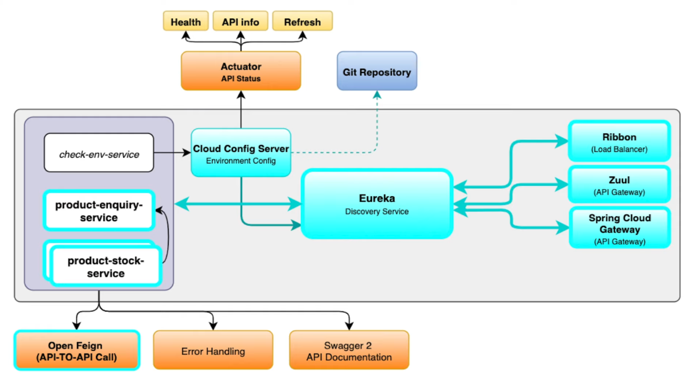

# micro-services-full-architecture

## Architecture


## Services Overview

### ms-eureka-naming-server (Port: 8777)
Service registry and discovery server built with Netflix Eureka. All microservices register themselves here, enabling them to discover and communicate with each other without hardcoded URLs.
- Built with `spring-cloud-starter-netflix-eureka-server` on Spring Boot 2.3.6 and Spring Cloud Hoxton.SR9
- Runs in standalone mode by default with self-registration and peer replication disabled
- Supports peer replication cluster mode via `peer1` and `peer2` Spring profiles
- Exposes Actuator endpoints for health monitoring and metrics via Micrometer and Prometheus
- Dashboard available at `http://localhost:8777` to view all registered services

### ms-product-stock-service (Port: 8800)
Manages product stock data backed by an H2 in-memory database. Exposes an endpoint to check stock details like product price, availability and discount offers. Supports running on multiple ports for load balancing.
- Uses Spring Data JPA with H2 in-memory database pre-loaded with sample data via `data.sql`
- Sample products loaded: bat (₹5000, 20% off), ball (₹500, 40% off), helmet (₹3000, 30% off)
- Entity fields: `id`, `productName`, `productPrice`, `productAvailability`, `discountOffer`
- Returns the active server port in the response to demonstrate load balancing across multiple instances
- Registered with Eureka for service discovery
- Exposes Actuator and Prometheus metrics endpoints

### ms-product-enquiry-service (Port: 8700)
Handles product enquiry requests from clients. Communicates with `ms-product-stock-service` via Feign Client to fetch stock details, then calculates the total price and discount for the requested quantity.
- Uses `spring-cloud-starter-openfeign` to communicate with `ms-product-stock-service`
- Accepts `productName`, `availability` and `unit` as path variables
- Calculates total price as `productPrice × unit` and applies discount percentage to return final discounted price
- Response includes: `id`, `productName`, `productPrice`, `productAvailability`, `discountOffer`, `unit`, `totalPrice`, `port`
- Registered with Eureka for service discovery
- Supports running on multiple ports for load balancing

### ms-zuul-api-gateway-server (Port: 8766)
API Gateway built with Netflix Zuul. Routes incoming requests to the appropriate downstream microservice and integrates with Eureka for service discovery.
- Built with `spring-cloud-starter-netflix-zuul` and `spring-cloud-starter-netflix-eureka-client`
- Routes `product-enquiry/**` to `ms-product-enquiry-service` on port `8700`
- Routes `product-stock/**` to `ms-product-stock-service` on port `8800`
- Supports service-name based routing via Eureka e.g. `/ms-product-enquiry-service/**`
- Configuration managed via `bootstrap.yaml`

### ms-spring-cloud-api-gateway-service (Port: 8900)
Alternative API Gateway built with Spring Cloud Gateway. Routes requests to downstream services using route configuration.
- Built with `spring-cloud-starter-gateway` as a modern reactive alternative to Zuul
- Routes `/product-enquiry/**` to `ms-product-enquiry-service` on port `8700`
- Registered with Eureka at `http://localhost:8777/eureka`
- Exposes full Actuator endpoints including health with details

### ms-spring-cloud-config-server (Port: 8889)
Centralized configuration server built with Spring Cloud Config. Fetches configuration properties from the `environment-variable-repo` folder in this GitHub repository and serves them to client microservices.
- Built with `spring-cloud-config-server` backed by this GitHub repository
- Reads property files from the `environment-variable-repo` folder on the `master` branch
- Supports multiple environments via profile-based property files e.g. `ms-property-access-service-dev.properties`, `ms-property-access-service-qa.properties`
- Client services connect to it via `http://localhost:8889`

### ms-property-access-service (Port: 8100)
Demonstrates Spring Cloud Config Client integration. Fetches properties from the config server and exposes them via a REST endpoint. Also triggers actuator refresh to reload properties without restarting the service.
- Connects to `ms-spring-cloud-config-server` at `http://localhost:8889` via `bootstrap.yml`
- Active profile set to `dev` by default, fetching `ms-property-access-service-dev.properties` from config server
- Auto-triggers `/actuator/refresh` on every request to pick up latest config changes dynamically
- Exposes `name` and `description` properties fetched from the config server
- Only the `refresh` actuator endpoint is exposed for security
## End Points

### Property Access Service
```
GET localhost:8100/access/accessPropertyFile
GET localhost:8100/actuator/refresh
```

### Product Stock Service
> Run stock-service and product-enquiry-service on multiple ports
```
GET localhost:8800/check-product-stock/productName/bat/productAvailability/yes
```

### Product Enquiry Service
```
GET localhost:8700/product-enquiry/name/bat/availability/yes/unit/3
```

### Zuul API Gateway
```
GET localhost:8766/ms-product-enquiry-service/product-enquiry/name/bat/availability/yes/unit/3
GET localhost:8766/ms-product-stock-service/check-product-stock/productName/bat/productAvailability/yes
```

### Spring Cloud API Gateway
```
GET localhost:8900/product-enquiry/name/bat/availability/yes/unit/3
```
